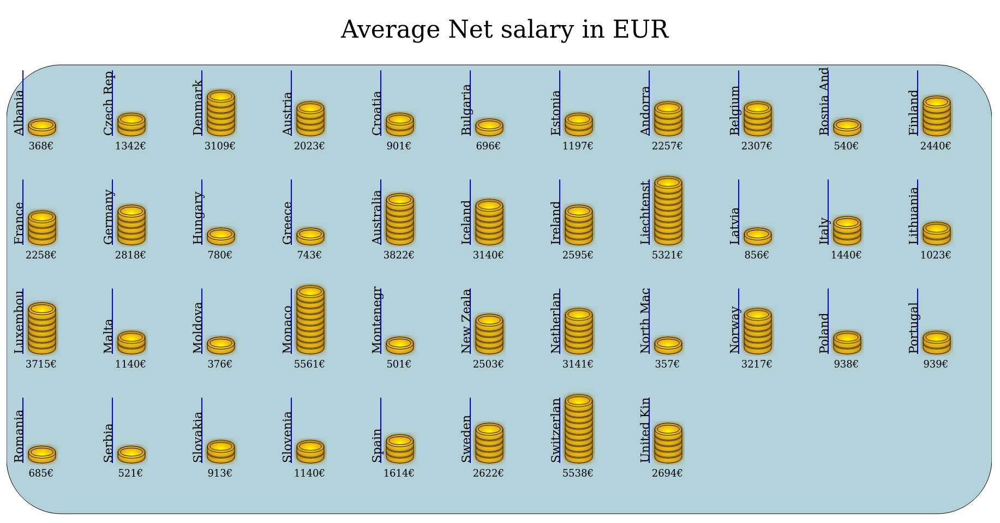
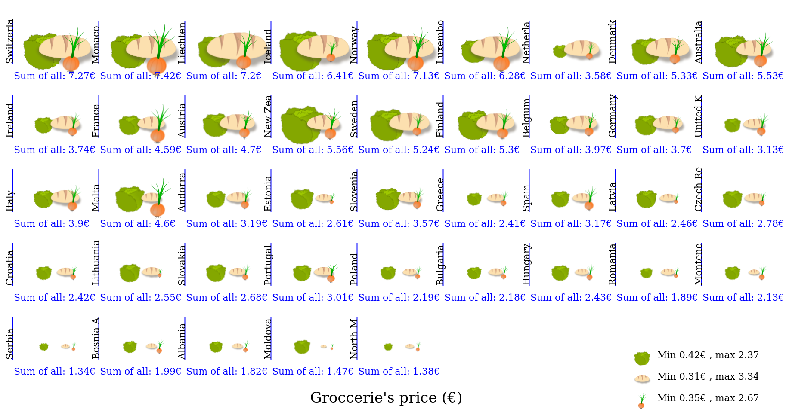
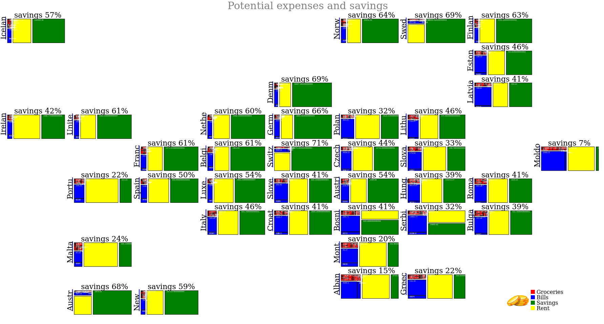

# cost-vizualization
Learn D3 using cost of living data from https://www.numbeo.com/cost-of-living/

# Data, icons

Data is mostly from European Union countries (with UK, Australia and New Zealand added for comparison) scraped on 2022-05. It is saved as csv file and manually adjusted as json for tree map visualization.

Icons used for visualization are drawn using Inkscape and saved as svg files.

# Tasks

1. Visualize mean salary of specified countries (in euros). Range of salaries is mapped from 1 to 10 coins for visualization, while precise salary is mentioned below (Currency was converted based on 2022-05-21 transfer rates).

Attempt is in "Coins_mean_salary" folder. 

2. Visualize prices of specified groceries (in euros). Images of items are scaled based on the price, while the sum of all shown items is mentioned below. Legend indicates relationship between images size and item prices (Currency was converted based on 2022-05-21 transfer rates).

Attempt is in "Scaled_groceries" folder. 

3. Try to use data provided in the numbeo.com tables to visualize expenses and potential savings in a treemap. Positions of each country were based on tiled Europe map from https://raw.githubusercontent.com/mustafasaifee42/Tile-Grid-Map/master/Tile-Grid-Map-Cleaned.json (Small countries that were in the scraped data, but not mentioned in the tile map were excluded from visualization. While Australia with New Zealand were artificially placed at the bottom).

Because my main task here was to familiarize with D3, it should be noted that:
 - "Groceries" part is a sum of all items from json table's groceries group. Therefore it **does not represent actual groceries cost**, but is just used as a comparison group
 - "Rent" in this case is cost of 1 bedroom appartment outside center
 - "Savings" group is calculated as a salary without "groceries", "rent" and "bills". Due to imprecise "groceries" group calculation (all items mentioned in numbeo website are taken only once. Should potentially be scaled, maybe itemwise even, to provide more realistic number) and excluded all other potential expenses (such as transport, clothes,...) this number **does not represent actual savings**, but is more like a qualitative measure for comparison/idea.  

Attempt is in "Expenses_treemap" folder. 
